# Stroke Prediction Dataset - Exploratory Data Analysis

## 👋|  About
This repository contains a project on Exploratory Data Analysis (EDA) applied to the [Stroke Prediction Dataset](https://www.kaggle.com/datasets/fedesoriano/stroke-prediction-dataset). The goal is to investigate and understand the patterns and characteristics of the data.

<details>
<summary> 🔬 | Project description </summary>

The project utilizes R and Python for conducting the analysis of the dataset. R is employed for the unidimensional analysis of qualitative variables, making use of its extensive range of packages specialized in data visualization and analysis. The main packages utilized in this phase are as follows:
- tidyverse
- esquisse
- ggthemes
- data.table
- outliers
- BHH2
- latex2exp
- moments
- modeest

For the unidimensional analysis of quantitative variables and the bidimensional analysis, Python is preferred due to its versatility in handling data analysis tasks. Python libraries such as Pandas, NumPy, Matplotlib, and Seaborn are utilized extensively. These libraries provide robust data manipulation capabilities, statistical functions, and advanced visualization capabilities. The bidimensional analysis is conducted using Python, leveraging its extensive data manipulation capabilities and the rich set of statistical and visualization libraries.



</details>


**Note:** The project requires **R**, **Python** and **Jupyer** to be installed on your system along with the necessary [packages](R/packages.R) mentioned above. To install them you can use:

[](https://cran.r-project.org/mirrors.html)
[](https://www.python.org/downloads/)
[](https://jupyter.org/install)

## 🌱 | Getting Started
1. Clone the repository:
   ```shell
   git clone https://github.com/vitornegromonte/EDA_stroke.git
   ```

2. Navigate to the project directory:
   ```shell
   cd EDA_stroke
   ```

3. For run the R scripts execute the file `R/packages.R` to install all the required packages.
