# Exploratory Data Analysis
# The code is a mess, ignore it for now
<!--
## About
This repository contains a project on Exploratory Data Analysis (EDA) applied to the [stroke prediction dataset](). The aim is to investigate and understand the patterns and characteristics of the data.
-->
<!--
## Run this project
````
git clone https://github.com/vitornegromonte/EDA_stroke.git
cd EDA_stroke
pip install -r requirements.txt
jupyter notebook 
````
-->

